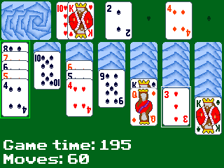

### Solitaire CElection

This is supposed to be a collection of solitare games in one program for the TI-84 Plus CE.

Currently only Klondike is implemented and it needs more work.

## Building

You will need three things to build this.

- The [TI-84 Plus CE C/C++ Toolchain](https://github.com/CE-Programming/toolchain) (To compile this repo)

- [The `LibLoad` library](https://github.com/CE-Programming/libraries/releases/latest) (Upload this to calculator)

- [This repo](https://github.com/GeometricParrot/Solitaire-CElection) (Obviously)

Run the `cedev.bat` file from the toolchain and navigate to the directory of this repo that you downloaded.

Run `make gfx`, then `make`.

## Running

In the `bin` dir there should be the built binaries. Upload `SOLITRCE.8xp` to your calculator, as well as `clibs.8xg` that also downloaded earlier. (Use [TI Connect CE](https://education.ti.com/en/software/details/en/CA9C74CAD02440A69FDC7189D7E1B6C2/swticonnectcesoftware) to upload to the calculator)

Press the `prgm` button on your calculator to see porgrams, then go down to `SOLITRCE` and press `Enter`.